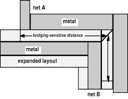
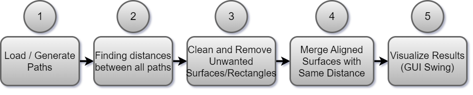
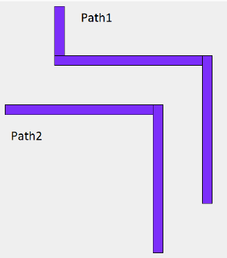
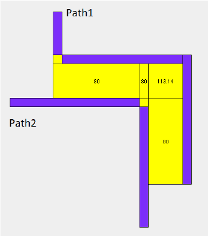
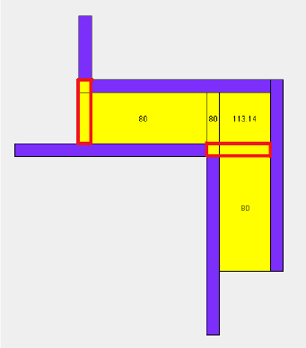
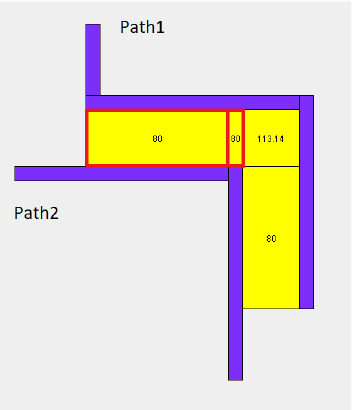
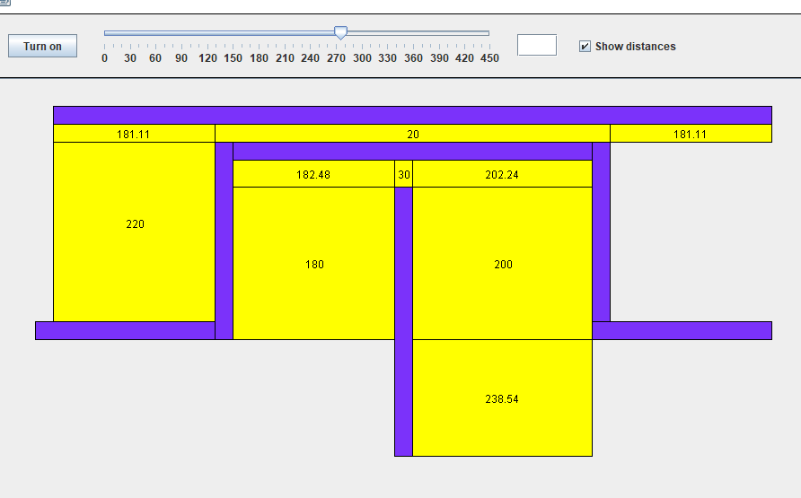

# Extracting Critical Areas from Circuit Layout for Bridging Fault Modeling

## Motivation

**What is Bridging faults ?**

 A bridging fault occurs when there is a short between two signal lines in a digital circuit.

**Why is it crucial to address bridging faults, and what impact do these faults have?**

Bridging faults may cause potential failures in safety-critical applications like automotive electronics, medical devices, and 
aerospace systems.

## Behavioral Overview of My Algorithm

1. **Load/Generate Paths :** We either load paths from an external database (text file) or generate them using a method that takes an integer as an argument, representing the number of paths to be generated.
 
    

2. **Finding distances between all paths :** We then calculate the distance between all paths and generate surfaces, each represents a certain distance.
   
    

3. **Clean and Remove unwanted surfaces/rectangles :** We remove all surfaces that overlap with any path.

    

4. **Merge Aligned Surfaces :** We merge all aligned surfaces that has the same distance.

    

5.  **GUI:** The user can use the GUI to change or calculate distances between paths.

    
## Usage

1. Download or clone the repository.
2. Locate the `Main` class in the source code.
3. Compile and run the program.
4. Select one of the files from the `paths` folder or specify the number of paths to generate.
5. Use the GUI to visualize paths and compute distances between them.
